# Clinical Risk Prediction for Heart Disease

Predicting in-hospital mortality in heart failure patients using logistic regression, built end-to-end across four notebooks: exploratory analysis, statistical inference, model building, and evaluation. The results are presented as they came out, including the parts where the model falls short.

---

## Table of Contents

1. [Tech Stack](#tech-stack)
2. [Key Learnings](#key-learnings)
3. [Dataset](#dataset)
4. [Project Structure](#project-structure)
5. [Notebook 01 - EDA & Preprocessing](#notebook-01---eda--preprocessing)
6. [Notebook 02 - Statistical Inference](#notebook-02---statistical-inference)
7. [Notebook 03 - Logistic Regression Model](#notebook-03---logistic-regression-model)
8. [Notebook 04 - Model Evaluation](#notebook-04---model-evaluation)
9. [Results Summary](#results-summary)

---

## Tech Stack

| Category       | Tools                                                           |
| -------------- | --------------------------------------------------------------- |
| Data           | `pandas`, `numpy`, `ucimlrepo`                                  |
| Visualisation  | `matplotlib`, `seaborn`                                         |
| Statistics     | `scipy.stats`, `statsmodels`                                    |
| Modelling      | `statsmodels` (inference), `sklearn` (pipeline, CV, deployment) |
| Explainability | `shap` (KernelExplainer, beeswarm, waterfall)                   |
| Persistence    | `joblib`                                                        |

---

## Key Learnings

**Data**

Statistical outliers in clinical data are not always errors. IQR flags 10% of values in some features, but all of them are physiologically plausible for a heart failure cohort. Domain knowledge is what makes the difference between removing signal and removing noise.

`time` is the most powerful predictor in this dataset visually, but it cannot be used in a prediction model. It encodes how long the patient was observed, which is only known after the fact. Missing this would mean building a model that leaks the answer.

With a 32% event rate, AUC-PR is a better evaluation metric than ROC-AUC. ROC-AUC is inflated by good performance on the majority class. AUC-PR focuses on the minority class, which is the one that matters clinically.

**Statistics**

Mann-Whitney U is the right choice for skewed clinical variables. Cliff's delta makes the effect size interpretable without distributional assumptions. Bootstrap CIs on the effect sizes add an extra check that the direction is stable, not just a sample artifact.

Running 11 simultaneous hypothesis tests without correction would inflate the false discovery rate. After Benjamini-Hochberg FDR, `creatinine_phosphokinase` and `platelets` lose significance. They would have been included in the model without correction.

**Modelling**

The reduced model with 4 features cross-validates better than the full model with 11. On small datasets, extra variables add variance without reducing bias. AIC explicitly penalises complexity and that penalty matters here.

Threshold calibration with Youden's J on the training set improves recall from 0.545 to 0.727. That is 14 additional deaths caught out of 77 in training, without touching the test set.

`statsmodels` and `sklearn` are complementary. The former gives interpretable coefficients and p-values. The latter gives a deployment-ready pipeline with consistent preprocessing across train and test.

Feature selection done outside of cross-validation gives optimistic CV scores. The 15-point drop from CV to test is partly an artifact of this choice. Nested CV would give a less biased estimate.

**Evaluation**

Without bootstrap confidence intervals, the test set metrics look like precise numbers. With n=60, a single misclassified patient changes recall by about 5 percentage points. CIs make that uncertainty visible.

A model can have decent AUC and still be miscalibrated. Calibration and discrimination are independent properties. Miscalibrated probabilities are a problem in clinical settings because clinicians and decision support tools rely on the actual probability values, not just the ranking.

Decision Curve Analysis reframes the evaluation from "how accurate is the model?" to "does using this model lead to better clinical decisions?". A model with ROC-AUC of 0.66 can still have positive net benefit if it is used in the right threshold range.

---

## Dataset

**UCI Heart Failure Clinical Records** (ID 519), from Chicco & Jurman (2020).

| Property | Value |
|---|---|
| Patients | 299 |
| Features | 12 clinical variables |
| Target | `death_event` (died during follow-up: yes/no) |
| Class balance | 68% survived / 32% died |
| Missing values | None |

The cohort comes from a hospital in Faisalabad, Pakistan (2015). The 32% event rate is a recurring constraint throughout the project: it influences the choice of metrics (AUC-PR alongside ROC-AUC), the use of stratified splits, and how the decision threshold is calibrated.

---

## Project Structure

```
notebooks/
    01_eda_and_preprocessing.ipynb
    02_statistical_inference.ipynb
    03_logistic_regression_model.ipynb
    04_model_evaluation.ipynb
src/clinical_risk/        # reusable modules: plotting, inference, modeling
models/                   # saved pipeline artifact
assets/                   # figures referenced in this README
```

---

## Notebook 01 - EDA & Preprocessing

The goal of this notebook is to understand what the data looks like before touching any model. That means checking distributions, looking for outliers, assessing skewness, and starting to see which features separate the two groups visually.

### Data quality

No missing values, no duplicates. Every observation falls within physiologically plausible limits, checked against published clinical reference ranges (for example, serum creatinine up to 20 mg/dL, ejection fraction between 5 and 90%).

IQR-based outlier detection flagged `creatinine_phosphokinase` (9.7%), `serum_creatinine` (9.7%), and `platelets` (7.0%). But after checking the values against clinical limits, all of them are medically explainable extremes: high CPK can appear in rhabdomyolysis, elevated creatinine is common in renal impairment. **All outliers were kept.** Removing them would mean losing signal in an already small dataset.

### Univariate distributions

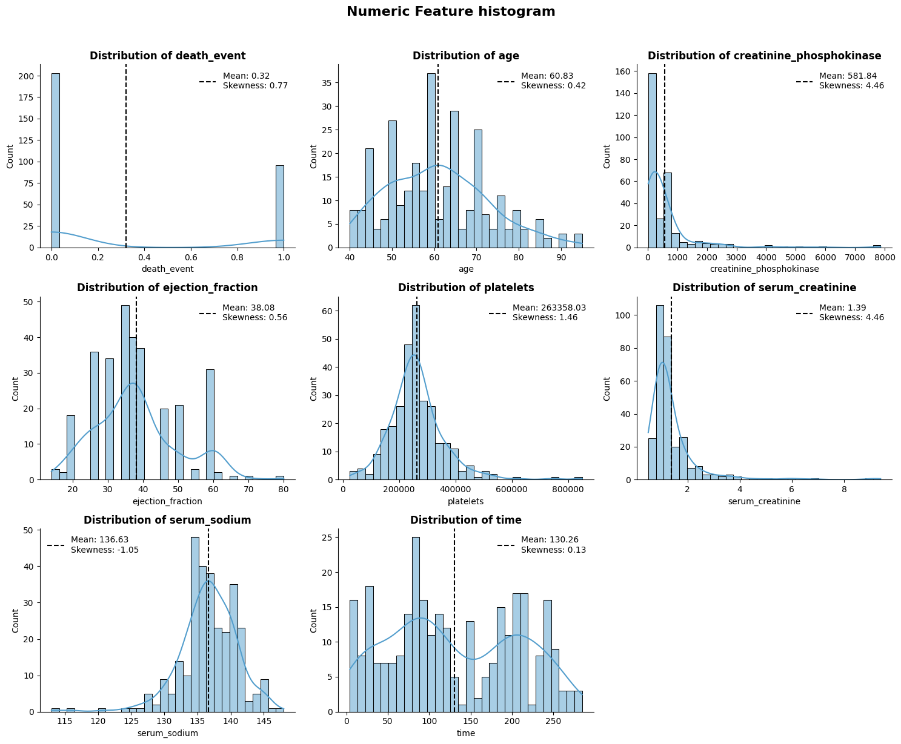

A few things stood out from the distributions:

- `creatinine_phosphokinase` and `serum_creatinine` are heavily right-skewed (skew around 4.46). Patients who died tend to sit higher.
- `ejection_fraction` is lower in the death group, which makes clinical sense: reduced cardiac output is the defining feature of systolic heart failure.
- `serum_sodium` is slightly lower in patients who died, consistent with hyponatraemia in decompensated heart failure.
- `time` (follow-up period) shows the clearest separation of all, but it is excluded from modelling. It is a follow-up variable, not something known at admission. Using it would be data leakage.

### Clinical outlier validation

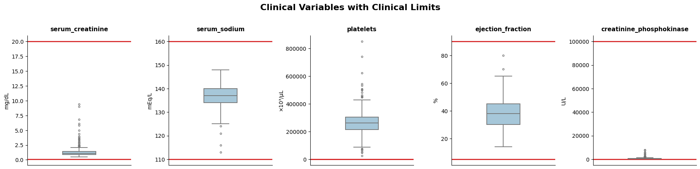

### Skewness and transformations

| Variable | Original skew | log1p skew | Decision |
|---|---|---|---|
| `creatinine_phosphokinase` | 4.46 | 0.42 | Apply log1p |
| `serum_creatinine` | 4.46 | 2.31 | Apply log1p |
| Others | below 1.5 | - | Keep original |

The transformation itself is applied in Notebook 03, not here. EDA should reflect the raw data.

### Bivariate patterns

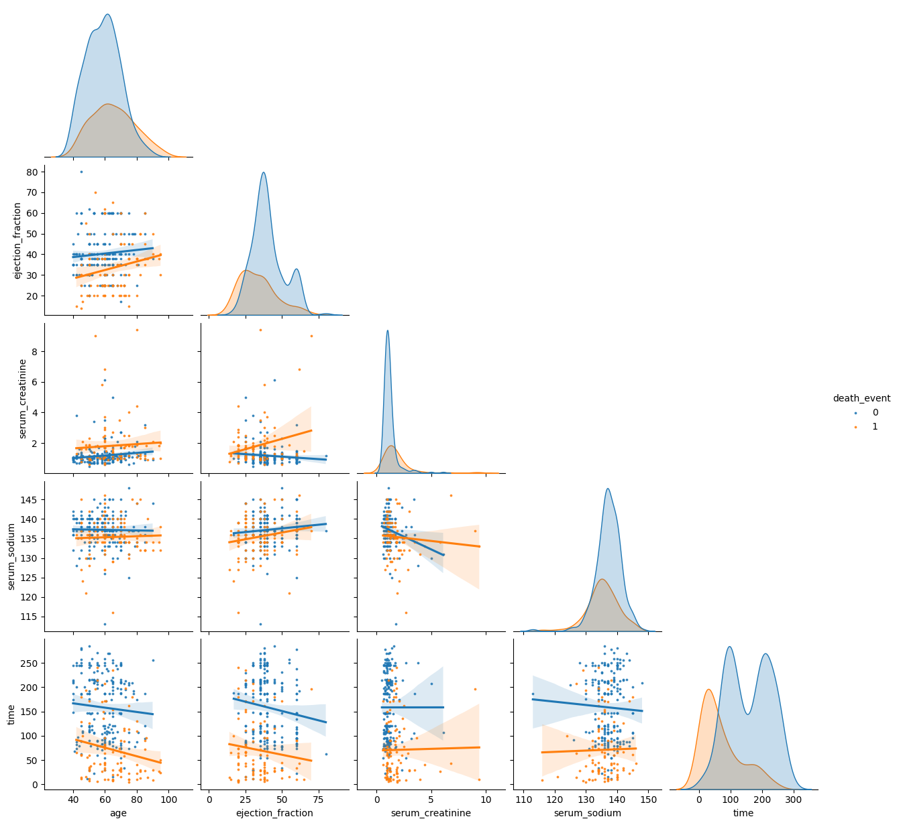

The pairplot makes it clear that `ejection_fraction` and `serum_creatinine` together are the most informative combination. Low ejection fraction plus high creatinine concentrates in the death group, which is consistent with cardiac-renal syndrome in advanced heart failure.

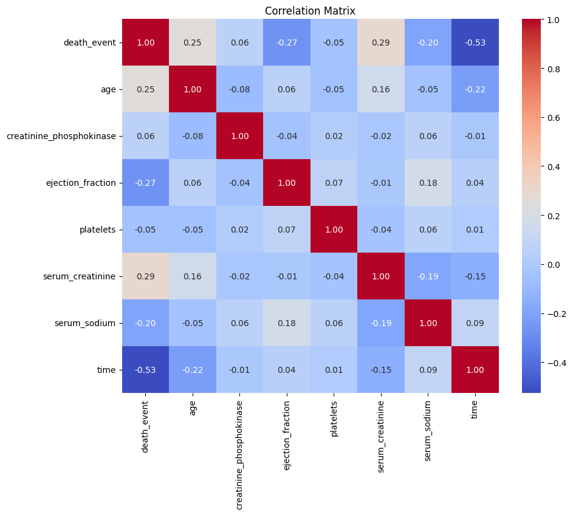

Feature correlations are low overall. No obvious multicollinearity concerns, which is confirmed later with VIF in Notebook 02.

---

## Notebook 02 - Statistical Inference

This notebook formalises what Notebook 01 showed visually. The idea is to test each feature before building any model, so that feature selection has a statistical basis and not just intuition.

### Methods

| Analysis | Variables | Test | Effect size |
|---|---|---|---|
| Group comparison | 6 continuous features | Mann-Whitney U | Cliff's delta + bootstrap 95% CI |
| Group comparison | 5 binary features | Chi-square / Fisher exact | Odds ratio + 95% CI |
| Multicollinearity | All 12 features | VIF | - |

All p-values were corrected for multiple testing using Benjamini-Hochberg FDR, applied separately within each family of tests.

### Continuous variables

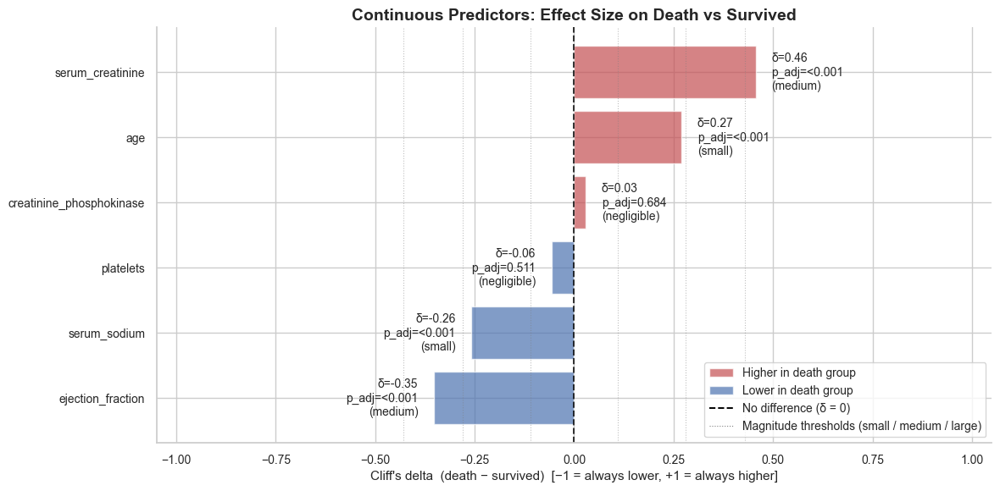

After FDR correction, four variables show a statistically significant difference between groups:

| Variable | Direction (death vs survived) | Cliff's delta | Magnitude | p_adj |
|---|---|---|---|---|
| `serum_creatinine` | Higher in death group | +0.456 | Medium | < 0.001 |
| `ejection_fraction` | Lower in death group | -0.352 | Medium | < 0.001 |
| `age` | Higher in death group | +0.269 | Small | 0.0003 |
| `serum_sodium` | Lower in death group | -0.258 | Small | 0.0004 |

`creatinine_phosphokinase` and `platelets` did not survive correction.

Mann-Whitney U was chosen because of the skewed distributions seen in Notebook 01. Cliff's delta was used instead of Cohen's d because it makes no distributional assumptions and is easier to interpret: a value of 0.456 for `serum_creatinine` means that in 45.6% of random pairs (one from each group), the patient who died had the higher value.

### Categorical variables

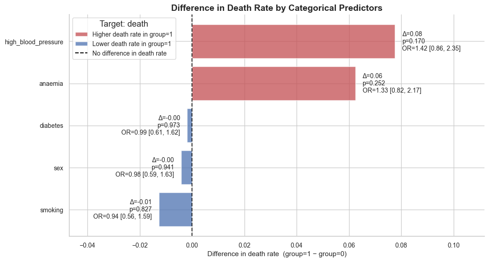

None of the five binary features (anaemia, diabetes, high blood pressure, sex, smoking) reached significance after FDR correction. All confidence intervals include 1.

This doesn't mean they have zero effect in combination with other variables. They're carried into the full model and removed only if AIC supports it in Notebook 03.

### Multicollinearity

All VIF values came in below 1.4. The rule of thumb is that values above 5 are worth investigating, and above 10 are a serious problem. Nothing to worry about here.

---

## Notebook 03 - Logistic Regression Model

Building the model in three steps: full model, log-transformed model, and a reduced model via backward AIC elimination. Everything is validated with stratified 5-fold cross-validation.

### Design decisions

| Decision | Rationale |
|---|---|
| `time` excluded | Only known at the end of follow-up, not at admission |
| Stratified 80/20 split | Keeps the 32/68 class ratio in both sets |
| Scaler fitted on train only | Avoids leaking test-set statistics into preprocessing |
| `statsmodels.Logit` | Gives coefficients, odds ratios, p-values, and AIC |
| No SMOTE or class weights | The dataset is too small to augment safely |

### Backward AIC elimination

Starting from the log-transformed model and removing one variable at a time:

```
Removing 'diabetes'                      242.48 -> 240.49
Removing 'platelets'                     240.49 -> 238.52
Removing 'smoking'                       238.52 -> 236.82
Removing 'log_creatinine_phosphokinase'  236.82 -> 235.20
Removing 'anaemia'                       235.20 -> 233.79
Removing 'sex'                           233.79 -> 232.48
Removing 'serum_sodium'                  232.48 -> 232.31
```

A likelihood ratio test confirmed that the seven removed variables do not significantly improve the fit (chi²(7) = 3.83, p = 0.80). The reduced model is the right choice.

### Reduced model - adjusted odds ratios

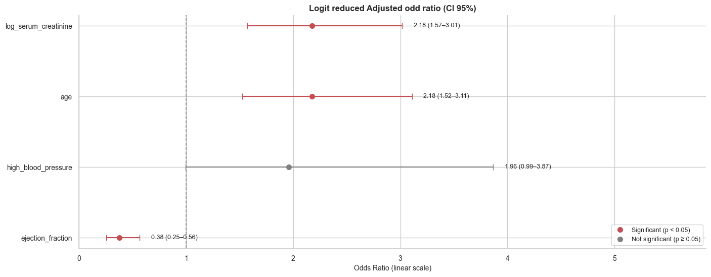

| Variable | OR | 95% CI | p-value | Clinical reading |
|---|---|---|---|---|
| `ejection_fraction` | 0.38 | [0.25, 0.56] | < 0.001 | Higher EF means better cardiac function, lower risk |
| `age` | 2.18 | [1.52, 3.11] | < 0.001 | Older patients carry more comorbidities |
| `log_serum_creatinine` | 2.18 | [1.57, 3.02] | < 0.001 | Renal impairment and cardiac function are linked |
| `high_blood_pressure` | 1.96 | [0.99, 3.87] | 0.052 | Increased afterload accelerates heart failure |

`high_blood_pressure` sits at p = 0.052. It was kept because AIC supports it and because hypertension is a well-established risk factor in heart failure. The wide CI reflects the small sample, not the absence of an effect.

### Cross-validation comparison

| Model | ROC-AUC | AUC-PR | AIC |
|---|---|---|---|
| Full | 0.790 +/- 0.101 | 0.646 +/- 0.128 | 242.16 |
| Log | 0.781 +/- 0.117 | 0.653 +/- 0.141 | 242.48 |
| **Reduced** | **0.810 +/- 0.099** | **0.698 +/- 0.150** | **232.31** |
| Baseline (majority class) | 0.500 | 0.322 | - |

The reduced model is the most parsimonious and performs best on both metrics. The eliminated variables were adding noise.

### SHAP explainability

Odds ratios give one average number per variable. SHAP gives each patient their own explanation. The two approaches are complementary.

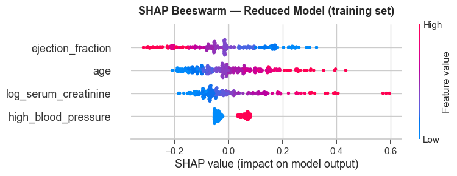

What the beeswarm shows:

- `ejection_fraction` is the most influential variable. High values push predictions toward survival consistently.
- `log_serum_creatinine` drives risk up strongly at high values.
- `age` adds a consistent positive contribution.
- `high_blood_pressure` has a smaller but stable positive effect.

All of this lines up with the clinical literature.

Two individual predictions illustrate how the model works in practice:

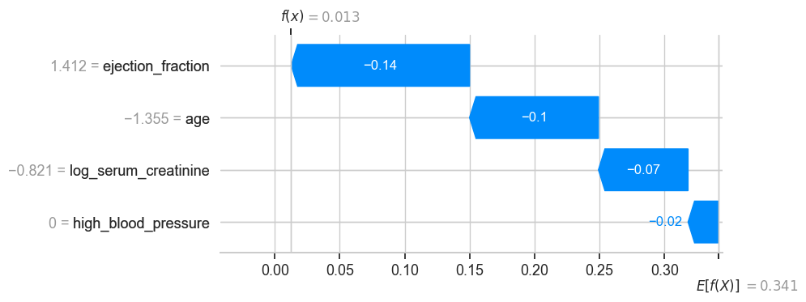

This patient has a high ejection fraction, is relatively young, and has low creatinine. The model starts from a baseline risk of about 34% and pushes it down to roughly 1%.

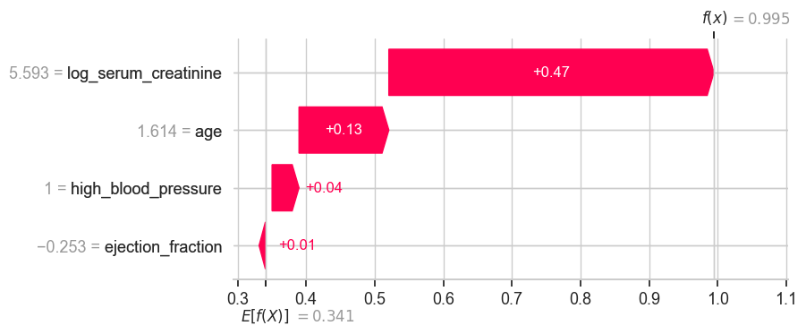

This patient has very high creatinine, is older, and has hypertension. Starting from the same 34% baseline, all four factors push the risk up to nearly 99%.

---

## Notebook 04 - Model Evaluation

Evaluating the reduced model on the held-out test set with bootstrap confidence intervals, threshold calibration, calibration curve, and decision curve analysis.

### Threshold selection

The default threshold of 0.5 is a poor choice when the event rate is 32%. A patient with a predicted probability of 0.40 is 25% above the population baseline, but threshold 0.5 would still classify them as low-risk.

The threshold was selected using Youden's J (sensitivity + specificity - 1) in 5-fold cross-validation on the training set. The five fold thresholds were [0.407, 0.419, 0.262, 0.338, 0.317], which gives a CV-selected threshold of **0.348**.

What this changes in practice, measured on the training set:

| Threshold | Recall | Precision | Deaths caught / missed |
|---|---|---|---|
| Default 0.50 | 0.545 | 0.689 | 42 caught / 35 missed |
| CV-selected 0.348 | 0.727 | 0.622 | 56 caught / 21 missed |

### Test set results

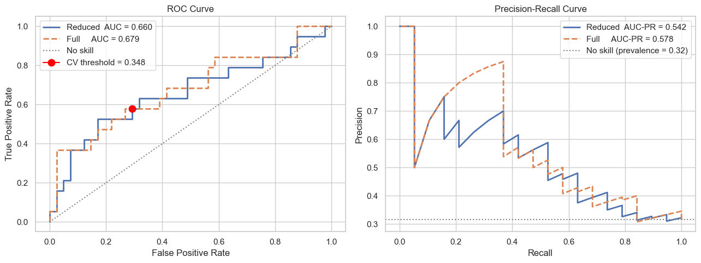

| Metric | Value | Bootstrap 95% CI |
|---|---|---|
| ROC-AUC | 0.660 | [0.490, 0.804] |
| AUC-PR | 0.542 | [0.361, 0.756] |
| Brier score | 0.211 | [0.151, 0.282] |
| Recall | 0.579 | - |
| Precision | 0.478 | - |
| F1 | 0.524 | - |
| Specificity | 0.707 | - |

### What the numbers actually mean

The cross-validation on the training set gave ROC-AUC = 0.810. On the test set it dropped to 0.660, a difference of 15 points. That gap is real and comes from three things stacking up together: the test set has only 60 patients (about 19 actual deaths), which makes estimates noisy; feature selection in Notebook 03 was done outside of cross-validation, which inflates the CV scores; and switching from statsmodels (no regularisation) to sklearn (L2) introduces slight shrinkage.

The lower bound of the ROC-AUC confidence interval is 0.490, which includes 0.5. That means we cannot statistically rule out that the model has no discriminative power in this sample. That is a weak result and it is reported as such.

The Brier score of 0.211 is barely better than the null model baseline, which is 0.32 x 0.68 = 0.218. The upper bound of the CI (0.282) is above that baseline. The model does not add much in terms of calibrated probability estimates.

### Calibration

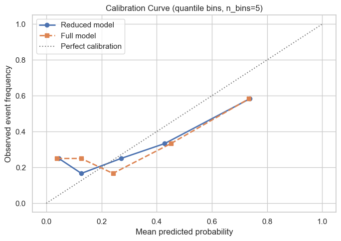

Hosmer-Lemeshow test: HL statistic = 15.81, p = 0.045. Evidence of miscalibration.

The curve shows an inverted S-shape: the model underestimates risk for low-probability patients and overestimates it for high-probability ones. This is the typical pattern when a model produces predictions that are more extreme than the data support. Before any clinical use, calibration with Platt scaling or isotonic regression would be necessary.

### Decision Curve Analysis

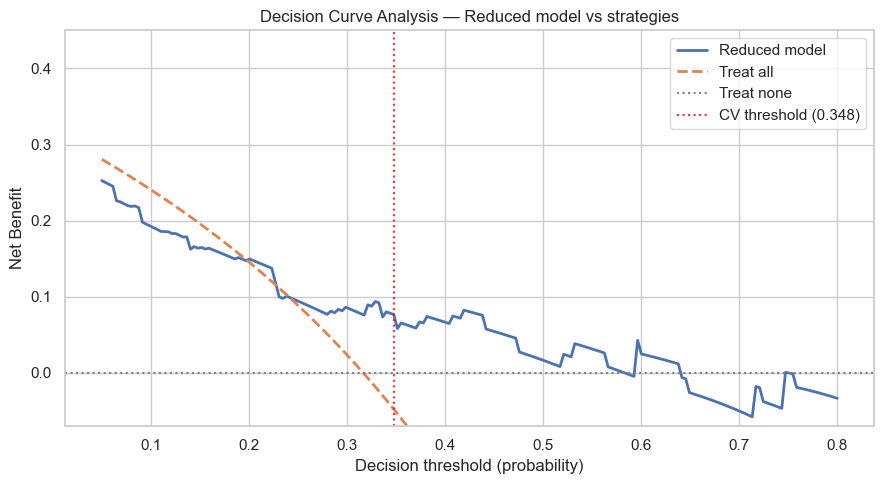

ROC-AUC and AUC-PR measure statistical performance. Decision Curve Analysis asks a different question: at a given clinical threshold, does using the model lead to better decisions than treating everyone or treating no one?

Net benefit is defined as:

    NB(t) = TP/n - FP/n * t/(1-t)

The weight t/(1-t) encodes how many false positives a clinician is willing to accept to avoid one missed death. In cardiology, a ratio between 1:1 and 4:1 is considered reasonable, which corresponds to thresholds roughly between 0.20 and 0.50.

Within that range, the model shows positive net benefit and outperforms both the treat-all and treat-none strategies. That is the main argument for its practical utility, despite the modest AUC numbers.

---

## Results Summary

| Aspect                 | Result                                         |
| ---------------------- | ---------------------------------------------- |
| Best features          | `ejection_fraction`, `serum_creatinine`, `age` |
| CV ROC-AUC (training)  | 0.810 +/- 0.099                                |
| Test ROC-AUC           | 0.660 [0.490-0.804]                            |
| Test AUC-PR            | 0.542 [0.361-0.756]                            |
| Recall at CV threshold | 0.579 (about 4 in 10 deaths missed)            |
| Calibration            | Miscalibrated (HL p=0.045, inverted S-pattern) |
| Clinical utility (DCA) | Net benefit at thresholds 0.20-0.50            |

The model correctly identifies the clinically meaningful predictors and the SHAP analysis confirms the learned relationships make sense medically. The decision curve supports its use within a realistic clinical range.

At the same time: with n=299 and a test set of 60 patients, the confidence intervals are too wide to draw strong conclusions. The model misses about 42% of deaths at the calibrated threshold. The probability estimates are miscalibrated. External validation on an independent cohort would be needed before drawing any conclusions about real-world performance.

---

*Dataset: Chicco D, Jurman G. Machine learning can predict survival of patients with heart failure from serum creatinine and ejection fraction alone. BMC Medical Informatics and Decision Making, 2020.*
